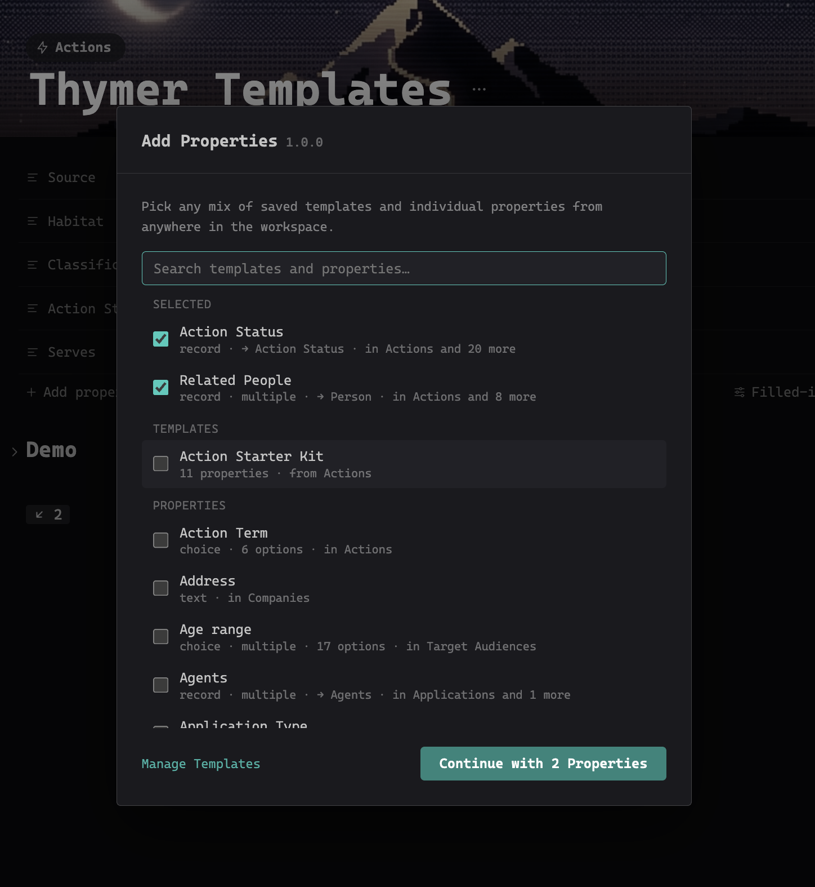
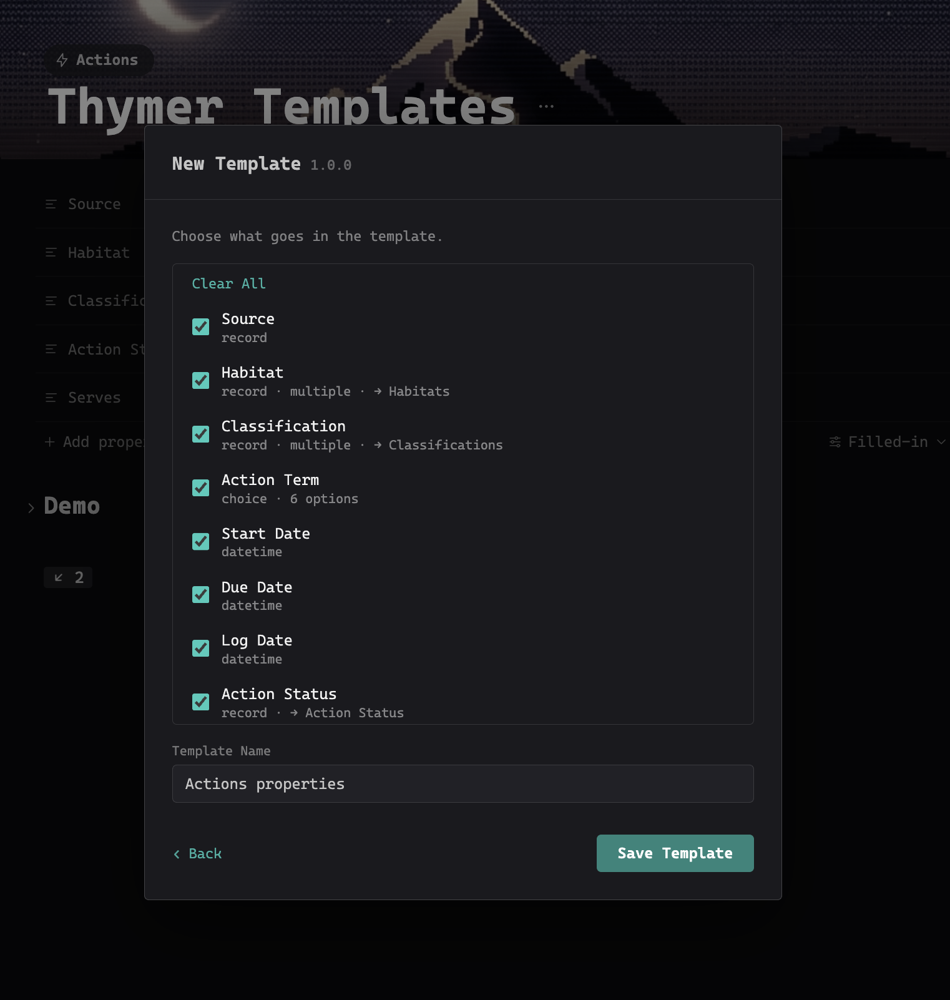
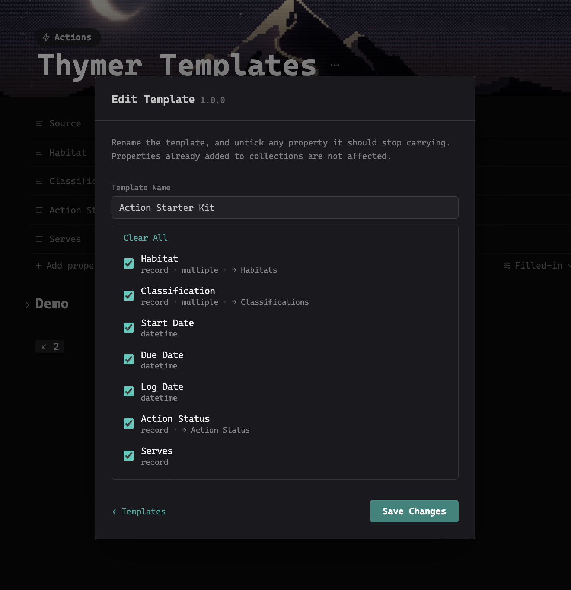

# Global Properties

Global Properties is a [Thymer](https://thymer.com) plugin that lets you reuse properties across collections. Take any property from anywhere in your workspace and add it to another collection, or save a whole set of them as a template and apply that instead.

Thymer's properties are defined per collection, so a "Status" you set up carefully in one place has to be rebuilt by hand everywhere else: the same type, the same options, the same colours, the same linked collection, every time. This plugin copies the definition instead.

## What it copies

The whole property definition, not just its name and type:

- the type, and the multi-value flag
- a choice property's options, with their colours
- a number property's format and currency
- which collection a linked-record property points at
- the icon

## How to use

Two commands in the Command Palette.

**Global Properties: Add Properties** is the main one. Pick any mix of saved templates and individual properties, choose which collections to add them to, and confirm. Both steps are multi-select, so several templates can go into several collections in one pass.

**Global Properties: New Template** saves a collection's properties as a reusable set. Pick the collection, tick what belongs in the template, name it.

Search matches property names, and the collections a property already lives in. Up and Down move through results, Enter takes the highlighted one, and what you have ticked rises to a **Selected** section at the top so a handful of picks scattered through a long list stay visible.

### It is additive, always

An apply only ever **adds** properties. It never edits, reorders or removes anything that is already in the target collection: every pre-existing property comes through byte-identical, and so does every other collection setting.

A property whose name the target already uses is skipped, and the last step spells out exactly what will be added and what will be skipped, per collection, before anything is written. You can untick anything there to leave it out of that one apply without changing the template.

New properties are added to the collection, not to any view. Add them as columns yourself where you want them.

### Templates

**Manage Templates** on the Add Properties screen lists everything you have saved. Each template can be applied, renamed, edited (drop properties it should stop carrying) or deleted. Deleting a template never touches properties already added to collections.

Templates are stored in the plugin's own configuration, so they sync with your workspace, and are mirrored to `localStorage` as a recovery copy.

## What it deliberately leaves alone

- **Formula properties.** A `dynamic` property carries no formula in its configuration; the formula lives in the collection plugin's code. Copying one would produce an empty shell wearing the right name, so they are not offered.
- **Built-in properties.** Title, Created, Modified, Banner, Collection, Icon and Parent page are system fields every collection already has.
- **Archived properties.** A property deleted from a collection but kept for its data (`active: false`) is never offered or copied.
- **Collections whose plugin owns their schema.** Such a plugin can rewrite its properties on load, so an apply would appear to work and then quietly revert.

## Duplicates

The same property built by hand in twenty collections has twenty different internal ids and lists twenty times. Global Properties groups by the property's **definition** instead, ignoring the id and the icon, and shows one row labelled with the collections that have it. Two properties that share a name but genuinely differ stay separate rows, with their collections listed so you can tell them apart.

## Requirements

Thymer 1.0.18 or later.

## Licence

MIT. See [LICENSE](LICENSE).
