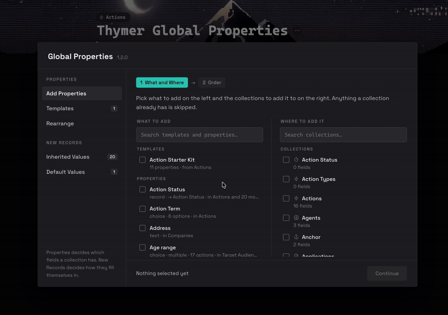
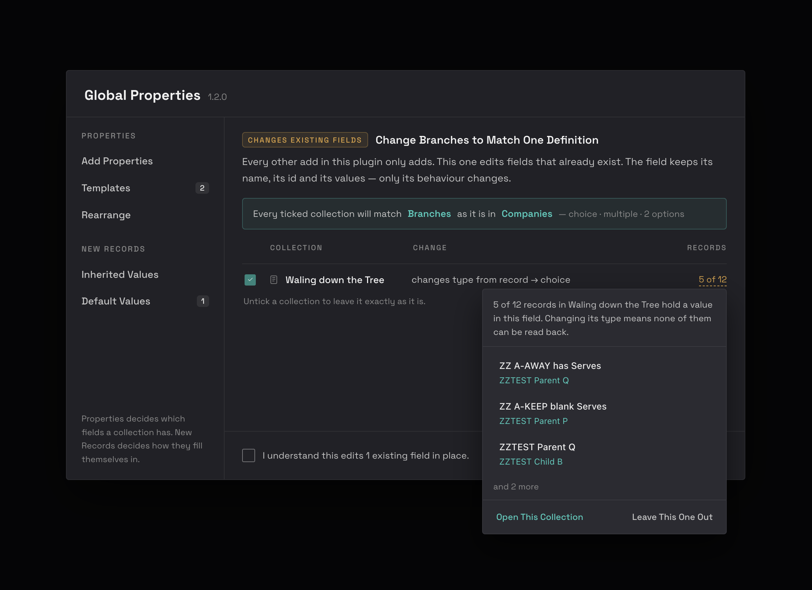
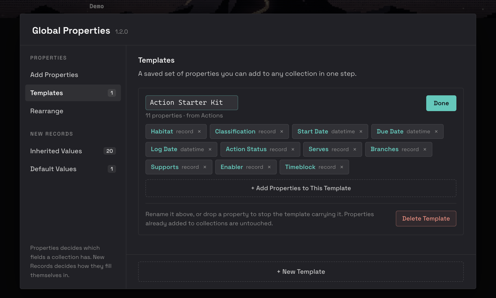
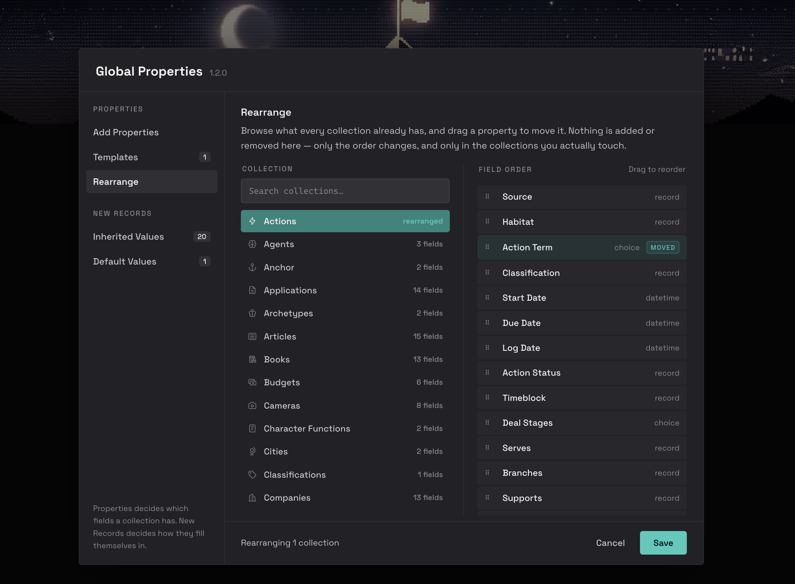
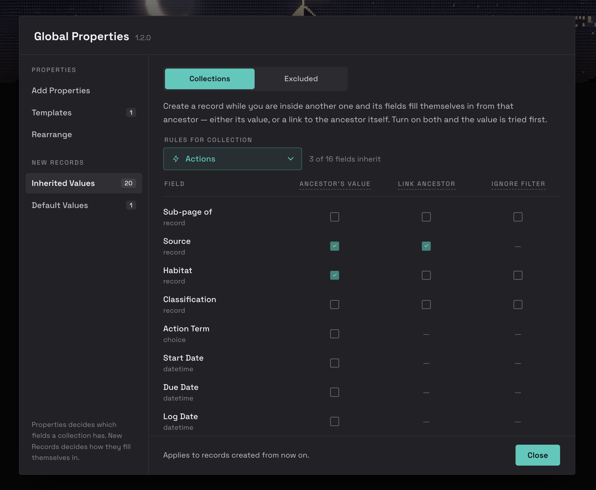
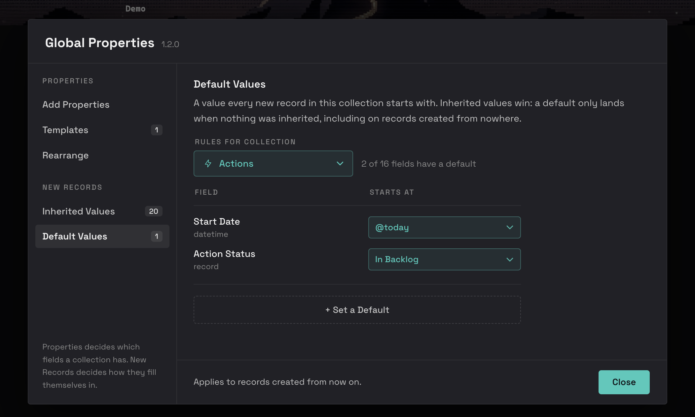
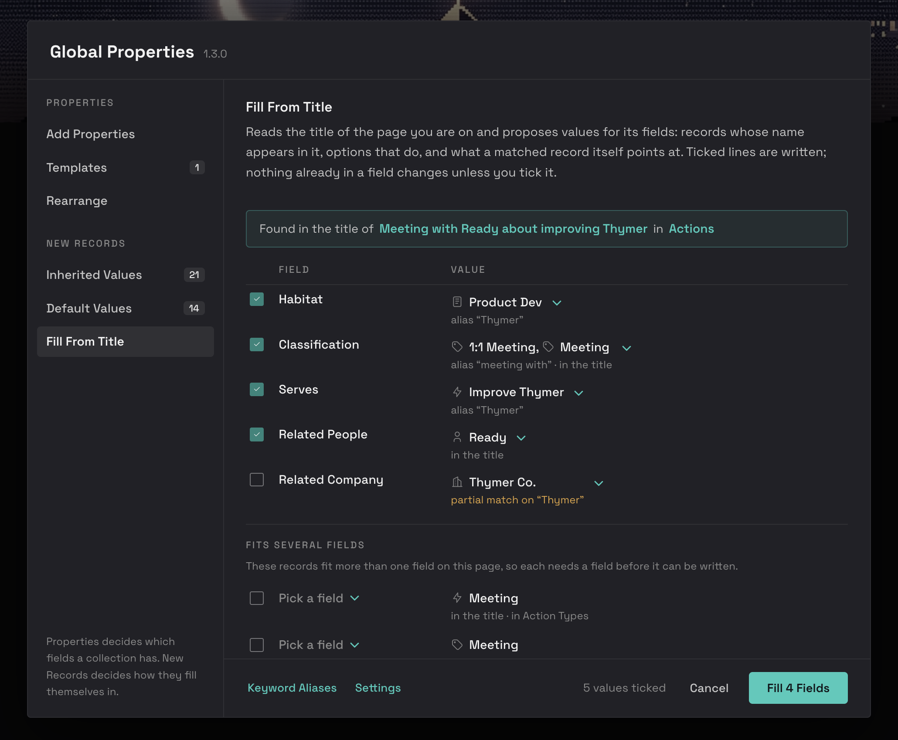
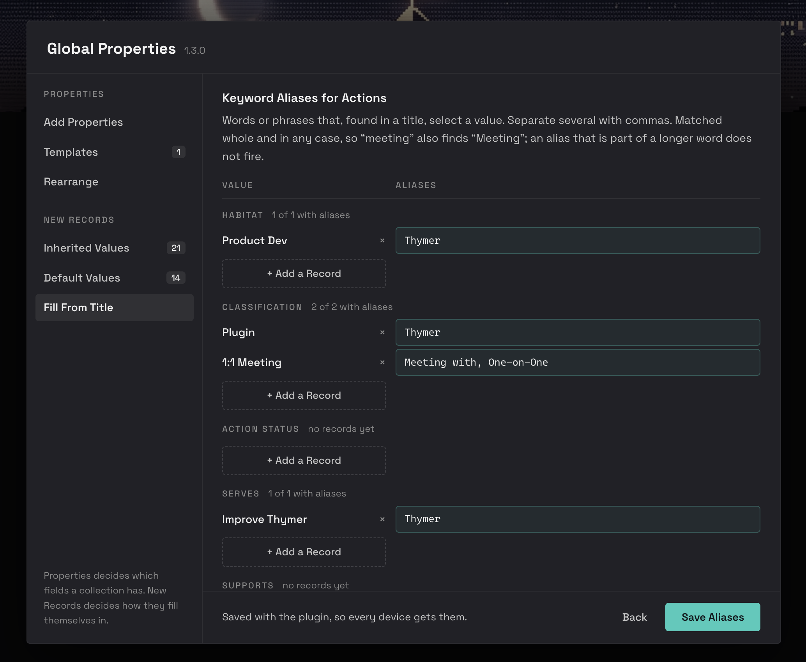
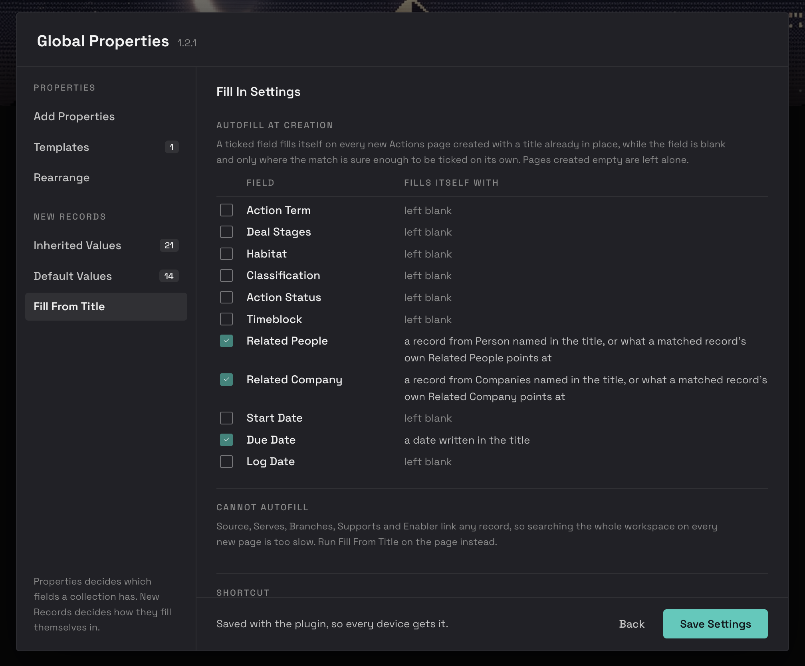

# Global Properties

Global Properties is a [Thymer](https://thymer.com) plugin that does two things: it decides **which properties a collection has**, and it decides **what a new record starts with**.

Thymer's properties are defined per collection, so a "Status" you set up carefully in one place has to be rebuilt by hand everywhere else: the same type, the same options, the same colours, the same linked collection, every time. And a record you create always starts empty, however much the record you created it inside already knew.

One dialog, six screens, split the way the work splits.

| PROPERTIES | |
|---|---|
| **Add Properties** | copy any property, or a whole template, into any collections |
| **Templates** | save a set of properties and apply it in one step |
| **Rearrange** | reorder any collection's properties by dragging |

| NEW RECORDS | |
|---|---|
| **Inherited Values** | a new record fills itself in from the record you created it inside |
| **Default Values** | a value every new record in a collection starts with |
| **Fill From Title** | a page fills its own fields in from what its title says |

Each screen has its own command in the Command Palette, all prefixed `Global Properties:`.

## Properties

### Add Properties

Two steps. **What and Where** puts properties and templates on the left and target collections on the right, each with its own search. Both halves are multi-select, so several templates can go into several collections in one pass, and every row says what the apply would do to it: *adds 2*, *adds 1, skips 1*. Ticked rows on both sides lift into a **Selected** group at the top, so a handful of picks scattered through a long list stay visible. **Order** then places the new fields among the existing ones, per collection, by dragging.

It copies the whole property definition, not just the name and type:

- the type, and the multi-value flag
- a choice property's options, with their colours
- a number property's format and currency
- which collection a linked-record property points at
- the icon

#### It only adds

An apply only ever **adds**. It never edits or removes anything already in the target collection: every pre-existing property comes through byte-identical, and so does every other collection setting.

The one thing it can change is **order**, and only where the interface says so. Step 2 places the new fields among the existing ones, and dragging an existing field there does move it. Leave the list alone and the order is untouched, down to the position of every built-in and archived field.

A property whose name the target already uses is skipped, and step 2 spells out what will be added and what will be skipped, per collection, before anything is written. Untick anything there to leave it out of that one apply without changing the template.

New properties are added to the collection, not to any view. Add them as columns yourself where you want them.

#### Change

Not a screen of its own and not in the sidebar: it is reached from a **drifted property's row, here in Add Properties**, because you only learn a definition has drifted while looking at that property. That fixes the direction for free.

It conforms a property **in place**: the id and the label are kept and only the behavioural keys are overwritten, because record values key on the id and a remove-and-re-add would orphan every one of them. It counts the records each change touches before you commit, and asks for a confirmation tick.

### Templates

A template is a saved set of properties you can add to any collection in one step. Each one is a card with **Add To** and **Edit**; everything that changes a template lives inside Edit, behind one deliberate step. Deleting a template never touches properties already added to collections.

Templates are stored in the plugin's own configuration, so they sync with your workspace, and are mirrored to `localStorage` as a recovery copy.

### Rearrange

Browse any collection and drag its properties into the order you want. It adds and removes nothing, and built-in and archived properties keep their exact positions. A property you have moved is marked **MOVED**, and dragging it back where it started clears the mark. Save stays disabled until something has actually moved.

## New Records

### Inherited Values

Create a record while you are inside another one and its fields fill themselves in from that ancestor. Three columns, in the order the engine tries them:

- **Ancestor's Value** copies the ancestor's value from its matching field into the new record.
- **Link Ancestor** links the ancestor record itself into this field.
- **Ignore Filter** applies where a record field is set to only link records from one collection. Turn it on to link the ancestor anyway, even when it comes from another one.

Turn on both of the first two and the value is tried first.

**Excluded** switches inheriting off for chosen collections, in both directions: nothing is inherited into them, and nothing is inherited from them while you are standing in one. For places you capture into rather than structure, like a journal or an inbox. Default values still apply there, because a default does not come from an ancestor.

### Default Values

A value every new record in a collection starts with. Inherited values win: a default only lands when nothing was inherited, including on records created from nowhere.

Value pickers list a collection's records in the order Thymer itself lists them, following that collection's own record sort, so a status list reads the way it reads everywhere else in the app.

### Fill From Title

Reads the title of the page you are on and proposes values for its fields. "Contact med Mamdooh om Dokumentär i Världen imorgon" knows the person, the company, the log type and the date. You tick what is right and press Fill; nothing already in a field changes unless you tick it.

Four things become a proposal:

- **A record whose name is in the title**, matched against the collection that field links to. Punctuation and spacing do not have to agree, so `Konst&Kulturakademin` finds *Konst & Kulturakademin*.
- **An option whose label is in the title**, or one of your aliases for it.
- **What a matched record itself points at**: the company a matched person works at, the people a matched company employs, the habitat a matched company sits in. The association counts whichever way it is stored — a field on the org, or an Employer field on the person. Records already linked on the page count as matches too, so a person you linked by hand still brings their company.
- **An abbreviation of a record's name**, derived from the name itself, nothing to maintain. `EPA` finds *Environmental Protection Agency*, `JLL` finds *Jones Lang LaSalle*, `DOE` finds *Department of Energy* — both ways English shortens, with or without the little words. An abbreviation only one record could mean comes ticked; one several records share comes unticked, like a partial match.
- **A date written in the title**, read the way Thymer reads it. `imorgon`, `nästa fredag`, `2026-05-12`, `May 12 at 14:00`. A month or a year alone is never a date, so a page called "Chimney Yard Party 2026" keeps its own.

One row per field. The chevron beside a value opens the field's picker with the cursor already in its search box: type and one query filters both of its groups — **from the title**, the matcher's proposals with their tick states, and **all** of the collection the field links to (or its options). A ticked candidate stays visible however you filter, so what Fill will write never leaves the page, and anything the matcher never proposed is a search away. Multi-value fields add and never replace, and a single-value field that already holds something says what ticking it would displace.

**Filling** sits under the title band: every ticked value as one chip, grouped by field, each with an × to take it back — the whole fill in one glance, before Enter or Fill commits it.

**Enter fills.** With the dialog open, press Enter and the ticked values are written, wherever the focus sits — right after the shortcut chord it is still in the editor, and that is where the hand already is. A popover open, or a button, link or input focused inside the dialog, keeps Enter for itself.

**Fits several fields** collects records that match a field which can link anything, where the record is certain and the field is the question. Pick the field and the row can be written.

**On this page** lists what the fields already hold, behind a toggle: the place to fix a value that an earlier fill got wrong. Pick a different one, or strike it.

Partial matches, single words out of a longer name, are proposed unticked and say so, because "Elin" is three people. A partial that survives inside what the title already matched is a different thing: "USDA meeting with Keith" names an org *and* a word, so the Keith who belongs to USDA comes ticked, however many Keiths the workspace holds.

#### Keyword Aliases

A word in a title that should select a value the record's own name would not match. `möte, samtal, avstämning` selects *Contact Log*; `KKA` selects *Konst & Kulturakademin*. Per collection, per field, per value, comma separated, matched whole and in any case. An alias is your rule, so a hit by alias comes ticked. Abbreviations you do not need to write: initialisms are derived from every name, so `EPA` finds *Environmental Protection Agency* by itself.

#### Fill In Settings

**Autofill at creation** lets chosen fields fill themselves on every new page that is created with a title already in place, while the field is blank and only where the match is sure enough to be ticked on its own. A page created empty is left alone: a title matched while it is still being typed fills the wrong things. The third column says in words what each ticked field will put there.

Fields that can link any record are left out of autofill and say so: searching the whole workspace on every new page is too slow. Run the command on the page instead.

**Shortcut**: ⌘⇧G opens Fill From Title anywhere in Thymer. Click the key field and press new keys to change it.

## If you use Auto-Init From Ancestor

The New Records half of this plugin is **Property Auto-Initiator** (Auto-Init From Ancestor), folded in. If you do not use that plugin, skip this section: there is nothing to do.

If you do, nothing changes until you choose it. The plugin is not touched, not disabled and not read from at runtime, and both plugins keep their own configuration.

**Importing.** While Global Properties has no rules of its own, Inherited Values and Default Values offer an import instead of an empty screen, naming what it found: how many rules, across how many collections, and how many blocklisted. Importing copies those rules across and leaves the other plugin's configuration exactly as it was.

**Both running at once.** After importing, if the old plugin is still switched on, a band at the top of both screens says so: the two would fill in the same properties as a record is created. **Turn It Off** switches it off and nothing else. Its rules stay where they are, so switching it back on restores what it did before, which makes it your rollback.

**One deliberate difference.** In the old plugin, a blocklisted collection abandoned the whole apply. Here the excluded list governs **inheriting only**. A record created inside an excluded collection still gets its fixed defaults, because a default does not come from an ancestor.

## What it deliberately leaves alone

- **Formula properties.** A `dynamic` property carries no formula in its configuration; the formula lives in the collection plugin's code. Copying one would produce an empty shell wearing the right name, so they are not offered.
- **Built-in properties.** Title, Created, Modified, Banner, Collection, Icon and Parent page are system fields every collection already has.
- **Archived properties.** A property deleted from a collection but kept for its data (`active: false`) is never offered or copied.
- **Collections whose plugin owns their schema.** Such a plugin can rewrite its properties on load, so an apply would appear to work and then quietly revert.

## Duplicates

The same property built by hand in twenty collections has twenty different internal ids and lists twenty times. Global Properties groups by the property's **definition** instead, ignoring the id and the icon, and shows one row labelled with the collections that have it. Two properties that share a name but genuinely differ stay separate rows, with their collections listed so you can tell them apart. When that difference is a mistake rather than a distinction, the row offers **Change**.

## Search

Search matches property names, and the collections a property already lives in. `+` is an AND. Up and Down move through results, Enter takes the highlighted one, and the highlighted row is marked the same way hover marks one.

## Requirements

Thymer 1.0.18 or later.

## Licence

MIT. See [LICENSE](LICENSE).
